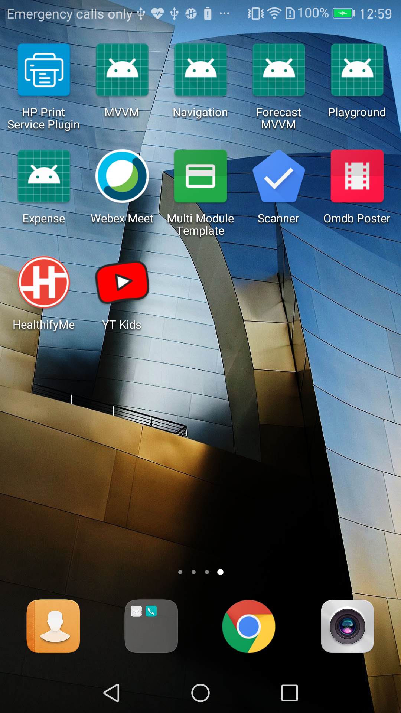
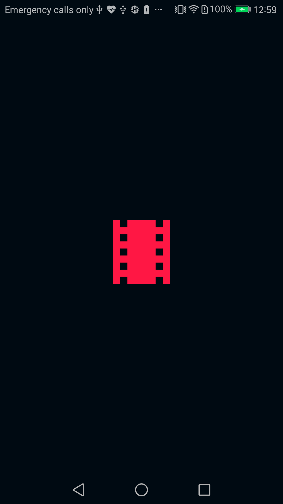
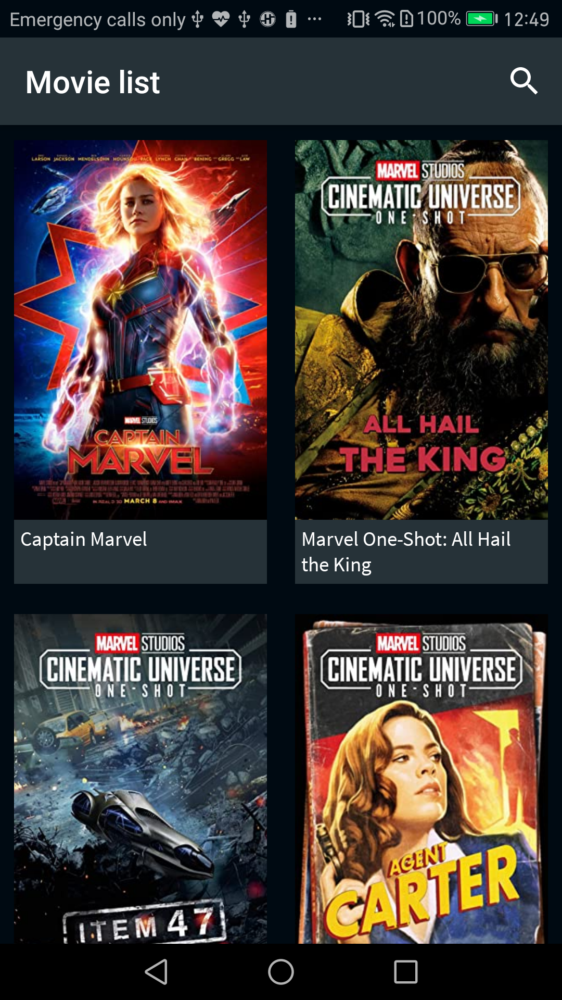
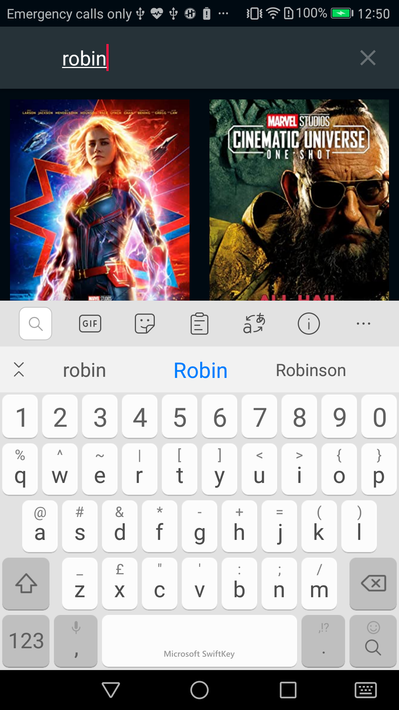
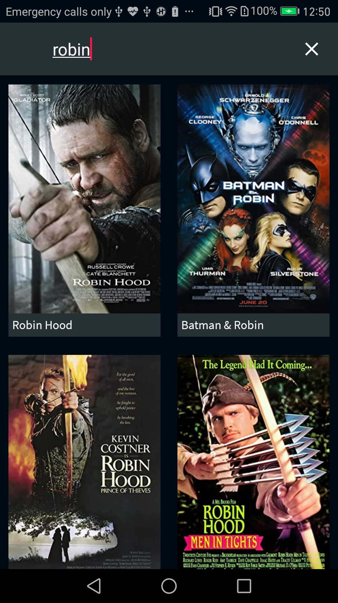
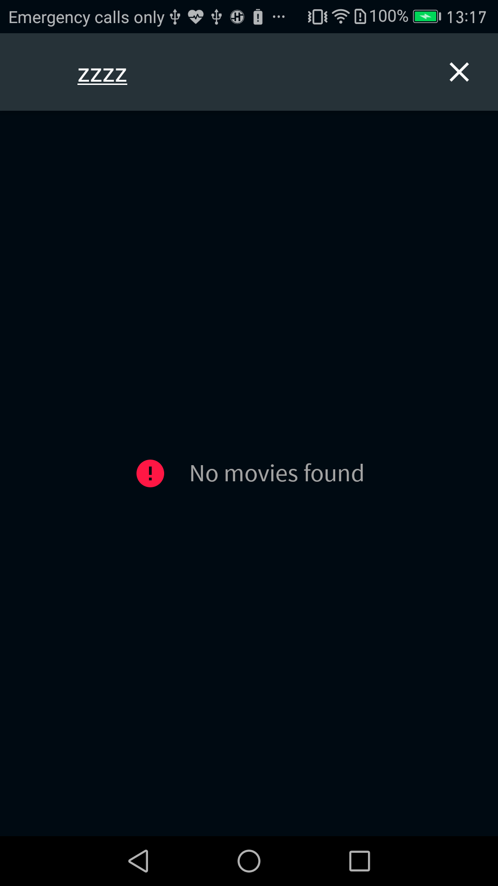
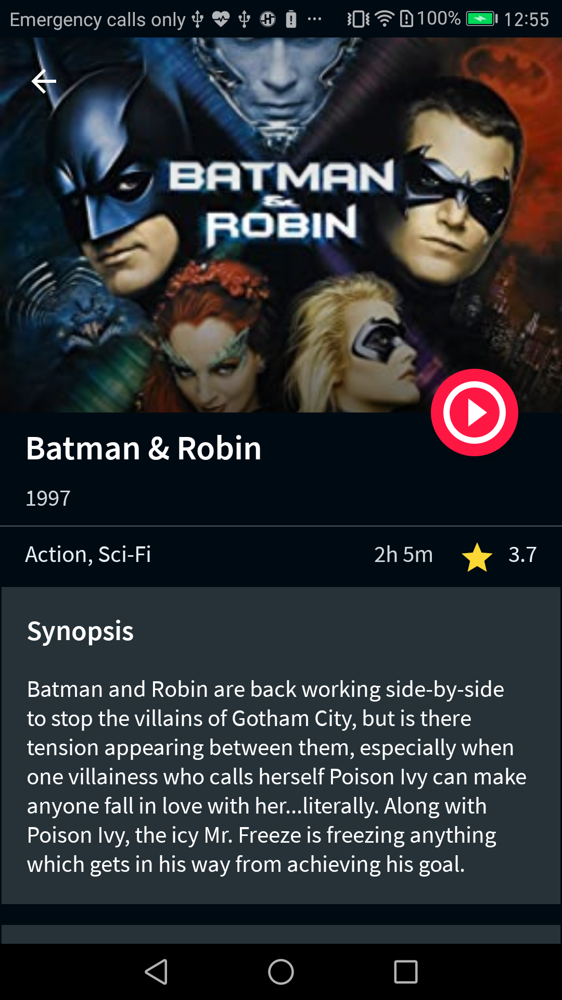
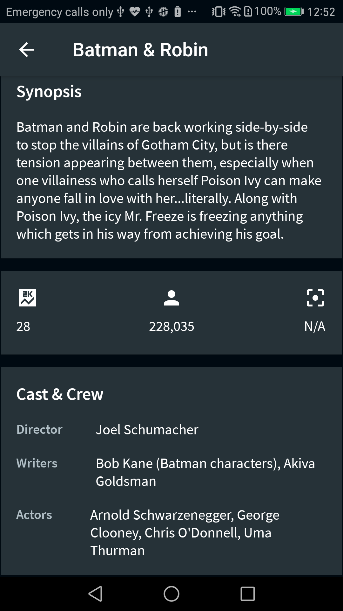
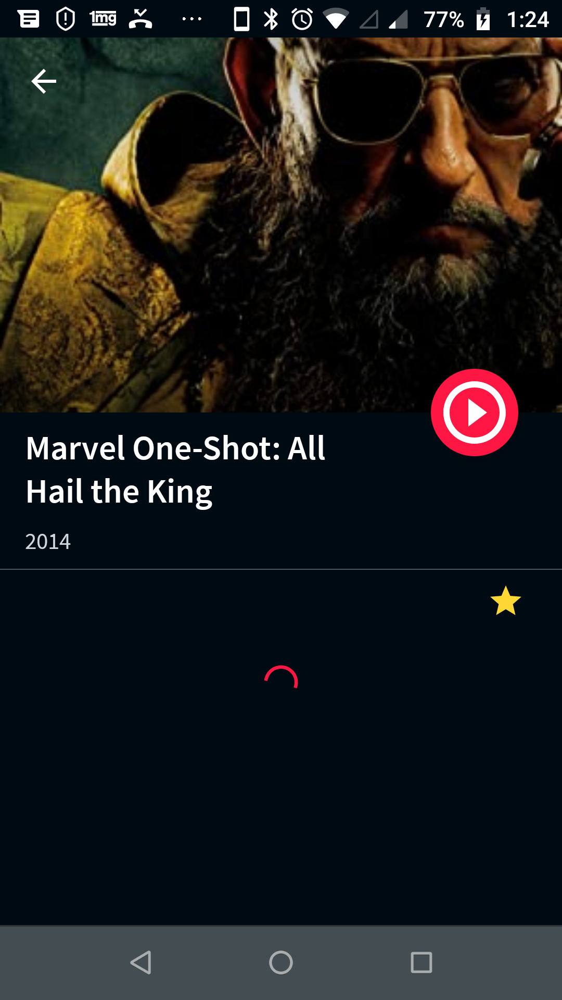

# Omdb Poster App
  This app is developed by following clean architecure using MVVM pattern and it uses the API from omdbapi.com to get the movie details and poster images. 
# Libraries
- Android Architecture Components
  - Paging
  - ViewModel
  - LiveData
- Android View Binding
- Kotlin Coroutines
- Retrofit for REST api communication
- Glide for image loading
- Koin for dependency injection

# Screenshots
<table>
  <tr>
     <td>Launch Icon</td>
    <td>Splash Screen</td>
    <td>Initial Load</td>
  </tr>
  <tr>
    <td></td>
    <td></td>
    <td></td>
  </tr>
   <tr>
     <td>With Search</td>
    <td>Search Result</td>
    <td>Movie List Error</td>
   </tr>
  <tr>
     <td></td>
    <td></td>
    <td></td>
  </tr>
   <tr>
    <td>Movie Detail</td>
    <td>Movie Detail</td>
    <td>Movie Detail Error</td>
  </tr>
  <tr>
    <td></td>
      <td></td>
 <td></td>
  </tr>
 </table>
 
 #Reference
- App asset generator - https://romannurik.github.io/AndroidAssetStudio/index.html
- Splash Screen - https://medium.com/@shishirthedev/the-right-way-to-implement-a-splash-screen-in-android-acae0e52949a
- Paging - https://blog.hipolabs.com/api-search-with-pagination-for-android-development-in-2020-f47717fb34ac
